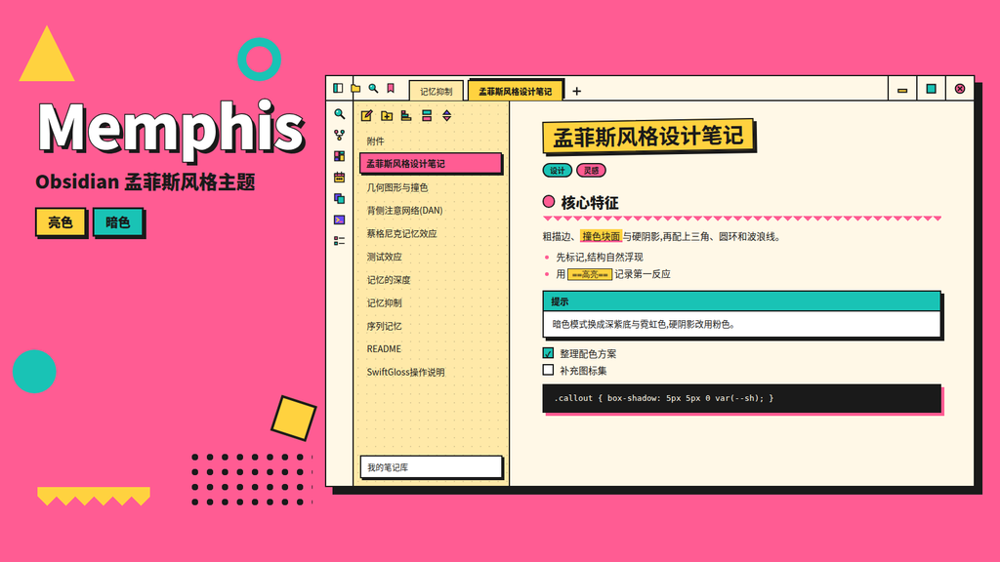

# Memphis

> An Obsidian theme inspired by 80s Memphis design — hard edges, bold candy colors, polka-dot sidebars, and zero rounded corners.

一个致敬 80 年代孟菲斯设计风格的 Obsidian 主题：硬边、糖果色、圆点底纹侧边栏，所有圆角归零。

## 外观

- **亮色模式 = 糖果**：奶油底 + 粉/青/黄/紫四色撞色
- **暗色模式 = 夜场**：深紫底 + 霓虹粉/青/黄/紫
- **硬边 + 0 圆角**：所有 `--radius-*` 归零，粗黑描边
- **圆点底纹侧边栏**：`radial-gradient` 点阵
- **粗 blockquote 边**：12px 色块边条

> Light = candy palette on cream; Dark = neon on deep purple. All radii zeroed, hard 2.5px ink borders, polka-dot sidebar texture, chunky 12px blockquote bars.

## 安装

1. Obsidian → Settings → Appearance → Community themes → 搜索 `Memphis`
2. 或手动：下载 `theme.css` + `manifest.json` 放入 `.obsidian/themes/Memphis/`

> Install via Community themes (search "Memphis"), or drop `theme.css` + `manifest.json` into `.obsidian/themes/Memphis/`.

## 字段说明

| 字段 | 值 |
|---|---|
| `minAppVersion` | 1.5.0 |
| `modes` | light, dark |
| `author` | Marko |

## 截图

---

MIT License
